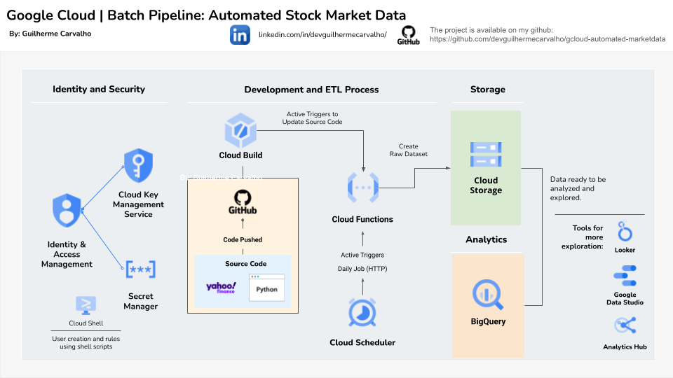

# Projeto

## Automatiza o processo de Extração, Transformação e Carregamento (ETL) de dados de mercado no Google Cloud Platform

Este projeto foi desenvolvido para solucionar um [desafio](./docs/questions.md) que tem por objetivo aprofundar o entendimento, a prática e a integração dos serviços do Google Cloud. Para isso, desenvolvi um pipeline simples de ETL de ações da API do Yahoo Finance, com uma atualização diária automatizada da execução do script.

## Pipeline

[Youtube - Vídeo de Execução do Projeto](https://youtu.be/odwkJvR5TtI)

## Ferramentas Utilizadas

- **Cloud IAM**

  - Criação de chaves de serviço, criação e gerenciamento de usuários.
  - Para a atribuição de mais de uma permissão, criei um script e o executei de forma independente, ganhando agilidade no processo. Para o gerenciamento de muitos usuários, essa pode ser uma boa alternativa para controle e verificação.

- **Cloud Functions e Cloud Build**

  - Criação de functions com integração do Cloud Build para sincronizar o código com o GitHub, beneficiando-se do versionamento de código e da utilização do serviço de segurança com autenticação, que pode ser feita através de chaves ou do serviço Secret Manager.

- **Cloud Scheduler**

  - Agendamento de gatilhos específicos do Cloud Functions para execução do pipeline de ETL.
  - Parte importante desse processo é garantir que códigos não sejam re-executados, como por exemplo, a função que obtém os dados históricos. É interessante que apenas a função que obtém novos dados e atualiza os já armazenados seja executada. Portanto, existe uma pré-verificação dos dados pré-existentes.

- **Cloud Storage**

  - Armazenamento das camadas de ETL diretamente do Cloud Functions.
  - Neste processo, destaco o armazenamento dos dados não transformados em formato Parquet, servindo como uma espécie de backup.

- **BigQuery**

  - Leitura e transformações de dados em SQL.

- **Looker**

  - Criação de dashboards.

# **Explicação detalhada de cada etapa do processo**

Neste projeto, realizei a extração de ações da bolsa de valores através da API do Yahoo Finance (yfinance) utilizando o Cloud Functions. Os dados foram separados em cada etapa do ETL no Cloud Storage. O objetivo do script é automatizar o processo de coleta das informações diariamente às 21h, alimentando o fluxo do sistema até chegar nas visualizações no BigQuery e, posteriormente, no Looker para a criação de dashboards.

* *No entanto, o foco deste projeto não é a exploração dos dados.*

## Cloud IAM - Configuração

Para criação das contas de usuários eu optei por escrever um script que ao ser executado faz a criação do usuário e já atribui as permissões e funções.

[Script: Criação do Usuário Admin:](src/scripts/assign_admin_roles.sh)
[Script: Criação do Usuário de Analista:](src/scripts/assign_analytics_roles.sh)

Contas Criadas:

- **Data Engineer - Administrator**

  - Controle total apenas das ferramentas utilizadas.
- **Analista - Administrator**

  - Controle de utilização apenas do BigQuery e do Locker.

### **Chave de Acesso:**

A Chave de Acesso/Service Account foi criada apenas para o usuário administrador, que tem controle total de todas as etapas do processo.

## Cloud Functions

- Para a utilização, é necessária a ativação das seguintes APIs: Cloud Build, Cloud Functions, Cloud Logging API, Cloud Pub/Sub, Cloud Run Admin API.
- Ambiente: 2ª geração (2nd gen).
- Tipo de Gatilho: HTTPS.
- Requer autenticação com o Cloud IAM.
- Conta de Serviço: Data Engineer Administrator.

## Cloud Build

O Cloud Build é responsável pelo versionamento do código e facilita o desenvolvimento, pois, através dele, conseguimos conectar o repositório do GitHub com o ambiente do Cloud Functions e sincronizar os arquivos a cada push.

# Cloud Storage

- **Buckets:**
  - project-data-market
  - **Pastas:**
    - **storage-raw-market-data**
      - Armazena os arquivos diretamente da API em formato .parquet, sem nenhuma transformação.
    - **storage-bronze-market-data**
      - Converte os arquivos .parquet para CSV e inclui algumas colunas de cálculos específicos.
    - **storage-silver-market-data**
      - Disponível para armazenamento de dados para análises.
    - **storage-gold-market-data**
      - Disponível para armazenamento de resultados e processos finais.

# Cloud Scheduler

O job do Cloud Scheduler foi configurado de forma simples para ser executado através do gatilho HTTP com o método POST às 21h de segunda a sexta-feira.

# BigQuery

Até o momento, o BigQuery está sendo utilizado somente para visualização final da tabela, deixando os dados totalmente disponíveis para prosseguir com análises ou compartilhamento com um cientista ou analista de dados.

# Locker

Será utilizado para gerar dashboards com informações sobre as ações.

# **Conclusão**

As ferramentas disponíveis no Google Cloud e suas interfaces gráficas fornecem uma experiência de aprendizado rápida. A Google busca mesclar ao máximo o gerenciamento das questões técnicas de cada ferramenta com a facilidade de uso, permitindo que o esforço se concentre no desenvolvimento central do projeto, em vez de nas questões técnicas da ferramenta. Eles garantem, com sucesso, que ela funcionará da forma mais adequada possível, com segurança, escalabilidade e desempenho aprimorado, e, se necessário, o upgrade é feito facilmente.

**Custos:** Os custos são acessíveis, pois as margens para início de cobrança para fins de estudo são consideravelmente altas (dependendo do projeto e das ferramentas). O controle de custos também é fácil, destacando-se a ferramenta de limite de custo, que é essencial para evitar surpresas.

**Resultado:** O resultado esperado foi alcançado, com o ETL sendo executado, os arquivos salvos e os carregamentos para análises concluídos com sucesso.

### Entre em contato para mais informações:

[LinkedIn - Guilherme Carvalho](https://www.linkedin.com/in/devguilhermecarvalho/)